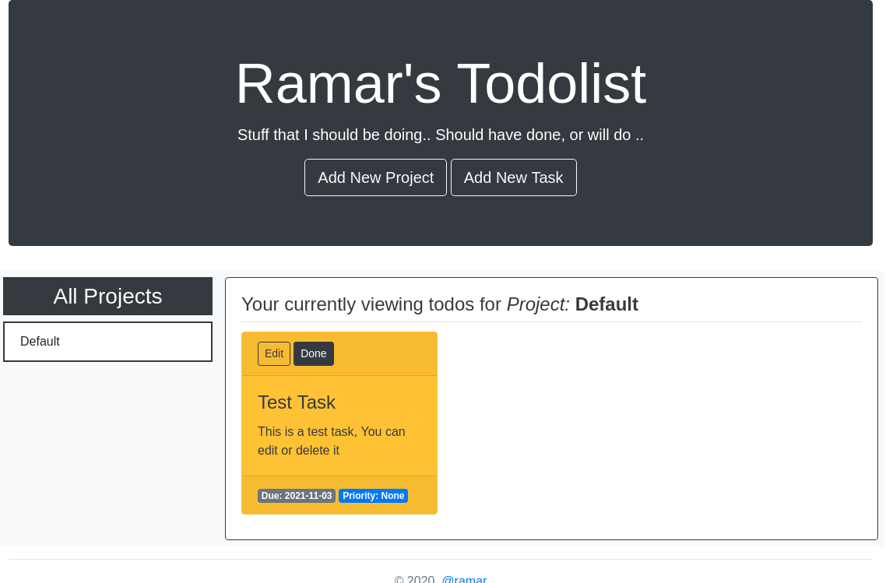

# Todolist App
A Todolist Application that uses localstorage to store data in between sessions.

## Features
* Can create Project
* Can Create Todo
* Can delete Todo
* Can Update todo
* UI Can sort todos by project

## Built With

- Javscript, HTML/CSS,
- Bootstrap,
- webpack

## Live Demo

[Live Demo Link](https://raheebwa.com/mv-todolist)

## Getting Started

To get a local copy up and running follow these simple example steps.

### Prerequisites
* NPM / NodeJS

### Setup
* Clone repo and at the root of application run npm install

### Usage

* Execute `npm run start` at root of application.
* Create Project
* Create Todo

## Authors

👤 **Aheebwa Ramadhan**

- Github: [@raheebwa](https://github.com/raheebwa)
- Twitter: [@raheebwa](https://twitter.com/raheebwa)
- Linkedin: [aheebwaramadhan](https://linkedin.com/aheebwaramadhan)

## 🤝 Contributing

Contributions, issues and feature requests are welcome!

Feel free to check the [issues page](issues/).

## Show your support

Give a ⭐️ if you like this project!

## 📝 License

This project is [MIT](lic.url) licensed.
